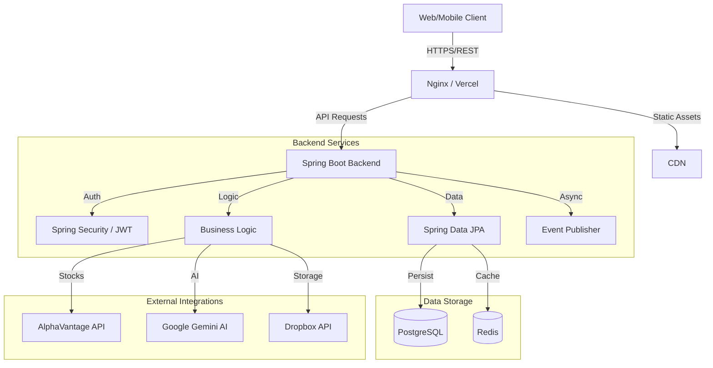

# Aerofisc - Personal Finance Command Center


**Aerofisc** is an enterprise-grade, AI-driven personal finance management system designed to provide comprehensive financial visibility, intelligent insights, and automated wealth management. Built on a microservices-ready Spring Boot architecture and a responsive React frontend, it bridges the gap between traditional budgeting apps and professional financial planning tools.

---

## 🚀 Key Features

### 🧠 AI-Powered Insights

- **Predictive Analytics**: Forecasts future expenses using historical data and linear regression models.
- **Smart Categorization**: automatically categorizes transactions using machine learning logic.
- **Voice Commands**: Integrated voice-to-action engine for hands-free financial management.

### 💰 Comprehensive Financial Management

- **Transactions & Budgeting**: Real-time tracking with drill-down capabilities.
- **Savings Goals**: Goal-oriented savings tracking with progress visualization.
- **Debt Management**: Snowball/Avalanche payoff simulators.
- **Investment Tracking**: Real-time stock portfolio monitoring (AlphaVantage integration).

### 🔒 Enterprise Security

- **JWT Authentication**: Stateless, secure authentication with refresh token rotation.
- **Role-Based Access Control (RBAC)**: Granular permissions for Users and Admins.
- **Data Encryption**: Sensitive data encryption at rest and in transit.

---

## 🏗 System Architecture



---

## 🛠 Tech Stack

### Backend

- **Framework**: Spring Boot 3.2.0 (Java 21)
- **Database**: PostgreSQL 15 (Production), H2 (Testing)
- **Security**: Spring Security, JWT (jjwt 0.12.3)
- **Docs**: OpenAPI / Swagger UI
- **Build Tool**: Maven

### Frontend

- **Framework**: React 18 (Vite)
- **UI Library**: Material UI (MUI) v5
- **State Management**: React Query (TanStack Query)
- **Charts**: Recharts
- **Styling**: Emotion

### DevOps & Infrastructure

- **Containerization**: Docker (Multi-stage builds)
- **Orchestration**: Docker Compose
- **CI/CD**: GitHub Actions
- **Hosting**: Render (Backend), Vercel (Frontend)

---

## 🔌 API Documentation

The API follows RESTful standards. Comprehensive interactive documentation is available via Swagger UI.

### Key Endpoints

| Method | Endpoint | Description |
| :--- | :--- | :--- |
| `POST` | `/api/auth/register` | Register a new user |
| `POST` | `/api/auth/login` | Authenticate and retrieve JWT |
| `GET` | `/api/transactions` | Retrieve user transactions (paged) |
| `POST` | `/api/ocr/upload` | Upload receipt for OCR processing |
| `GET` | `/api/analytics/summary` | Get financial dashboard summary |

> **Note**: Full documentation is available at `/swagger-ui.html` when running the backend locally.

---

## 🐳 Local Development (Docker)

The easiest way to run the full stack is via Docker Compose.

### Prerequisites

- Docker & Docker Compose
- Git

### Quick Start

1. **Clone the repository**

   ```bash
   git clone https://github.com/Satya136-dvsn/Aerofisc.git
   cd Aerofisc
   ```

2. **Configure Environment**
   Create a `.env` file in the root directory (optional, defaults provided in `docker-compose.yml`):

   ```properties
   POSTGRES_PASSWORD=secure_password
   JWT_SECRET=your_long_secure_secret
   ```

3. **Start Application**

   ```bash
   docker-compose up -d --build
   ```

4. **Access Application**
   - Frontend: `http://localhost:80`
   - Backend API: `http://localhost:8080`
   - Swagger Docs: `http://localhost:8080/swagger-ui.html`

---

## 🖥 Local Development (Manual)

### Backend Setup

1. Additional prerequisites: Java 21, Maven.
2. Navigate to backend: `cd backend`
3. Run application:

   ```bash
   mvn spring-boot:run
   ```

### Frontend Setup

1. Additional prerequisites: Node.js 18+.
2. Navigate to frontend: `cd frontend`
3. Install dependencies:

   ```bash
   npm install --legacy-peer-deps
   ```

4. Start dev server:

   ```bash
   npm run dev
   ```

---

## 🧪 Testing & Quality

- **Backend**: Run `mvn test` for unit and integration tests (JUnit 5, Mockito).
- **Frontend**: Run `npm test` for component testing.
- **CI/CD**: Automated pipelines run on every push to `master`, executing build checks and tests.

---

## 🔮 Roadmap

- [ ] Mobile App (React Native)
- [ ] Bank Account Integration (Plaid)
- [ ] Advanced Investment Forecasting (Monte Carlo Simulations)
- [ ] Multi-currency Support

---

## 📄 License

This project is licensed under the MIT License - see the [LICENSE](LICENSE) file for details.

---

**Developed by Satya136-dvsn**
